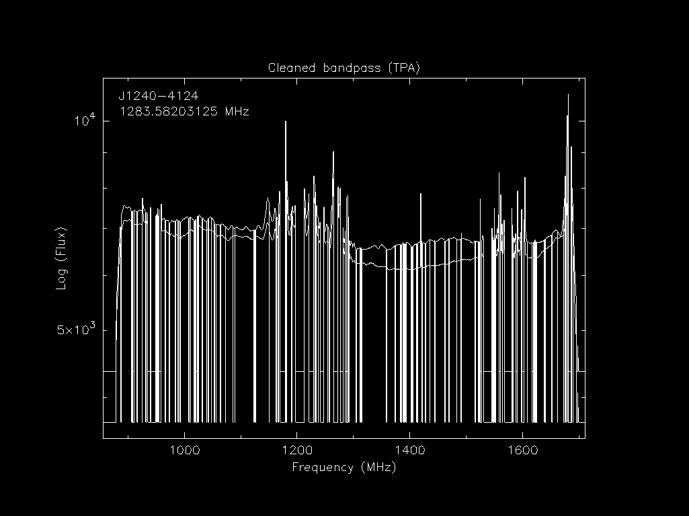
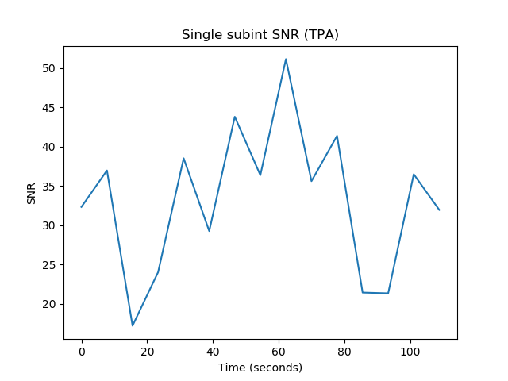

# Pipeline workflow

The following describes the steps that each observations launched by the pipeline takes.

## Get archives and metadata

The pipeline uses `psrdb.py` to get the metadata of an observation including, the UTC start time, the pulsar PSRJ name, the project short code (PTA, RelBin, TPA or GC), the beam number and the centre frequency.
This information is used to find the location of the archive files on OzSTAR:

```
/fred/oz005/timing/<pulsar_jname>/<UTC_start>/<beam_number>/<centre_frequency_MHz>/
```

These archives come out of the MeerKat pulsar backend (the Pulsar Timing User Supplied Equipment (PTUSE) [Bailes et al. 2020](https://ui.adsabs.harvard.edu/abs/2020PASA...37...28B/abstract)) as individual eight second archive files.
We use the `psradd` command (a `psrchive` script) to combine these archives into a single archive for further processing.

## Calibrate

The delays are corrected with the `dlyfix` command (from the  `dylfix` repo).
Depending on the date of the observations, the polarisation is either already applied before being transferred to OzSTAR, or must be applied using a Jones matrix.
The jones matrix must be applied using the `pac -Q` command (a `psrchive` script) for UHF band observations prior to approximately 18/08/2021 and L-band observations prior to approximately 10/04/2020.
Observations after these dates only need to have their polarisation headers updated with the `pac -XP` command.
The data is also corrected for the Faraday rotation using the rotation measure (RM) if known, from a RM list provided from the project configuration or the [ATNF Pulsar Catalogue](http://www.atnf.csiro.au/research/pulsar/psrcat/).

## Clean

The archives are cleaned of RFI using the command `clean_archive.py` (a `MeerGuard` script).
The cleaning is described as:
The surgical cleaner reads in a template, which is subtracted from the data to form profile residuals.
The template can be frequency-dependent if required (e.g. if there is substantial profile evolution) and is used to identify an off-pulse region.
The statistics used by the surgical cleaner are calculated only using this off-pulse region.

## Decimation

The data are then decimated, reduced in resolution across any of the time, frequency and polarisation axes per the scientific needs of the project.
This is done with the following `psrchive` command
```
pam --setnsub <nsub> --setnchn <nchan> -S <stokes_op>
```

Common values for `nsub` are 1, 32 and 450.
Common values for `nchan` are 1, 16 and 32.


## Flux calibrate

The flux calibration is performed by the `fluxcal.py` command (a `meerpipe` script).
It adjusts the archive units so they are in flux units by multiplying them by the expected RMS and dividing them by the observed RMS ({math}`C_F=\sigma_c/\sigma_\mathrm{obs}`).
The observed RMS is the median RMS of the off pulse values of the centre channels (1383-1400 MHz for LBAND and 795-805 MHz for UHF band).
The expected RMS ({math}`\sigma_c/`) is obtained from the following equation based on Equation 1 of [Posselt et al. (2023)](https://ui.adsabs.harvard.edu/abs/2023MNRAS.520.4582P/abstract):

```{math}
\sigma_c = \frac{\mathrm{SEFD}+T_{\mathrm{sky}}}{ N_{\mathrm{ant}} \sqrt{2 \times \Delta \nu_{\mathrm{bw}} N_{\mathrm{ch}}^{-1} \times t_{\mathrm{obs}} N_{\mathrm{bin}}^{-1} }}
```
Where {math}`\mathrm{SEFD}` is the known system equivalent flux density for a single dish, {math}`T_{\mathrm{sky}}` is the expected sky temperature, {math}`N_{\mathrm{ant}}` is the number of antenna, {math}`\nu_{\mathrm{BW}}` is the frequency bandwidth, {math}`N_{\mathrm{chan}}` is the number of frequency channels, {math}`t_{\mathrm{obs}}` is the length of the observation and {math}`N_{\mathrm{bin}}` is the number of phase bins in the pulse profile.

For LBAND the {math}`T_{\mathrm{sky}}` map is obtained from the HIPASS 'point-source' continuum map at 1.4 GHz described in [Calabretta et al. (2014)](https://ui.adsabs.harvard.edu/abs/2014PASA...31....7C/abstract) which has been altered by the method described in [Posselt et al. (2023)](https://ui.adsabs.harvard.edu/abs/2023MNRAS.520.4582P/abstract) to be comparable with MeerKAT's smaller beam.

## Create ToAs and residuals

The pulse ToAs are calculated from each of the decimated data products using [`tempo2`](https://bitbucket.org/psrsoft/tempo2).
Each project has their own templates and ephemerides the resulting ToAs and residuals may vary.
A single 'representative' set of ToAs are also calculated; these are then used to produce residual plots both the 'local' ToAs specific to the observation being processed, as well as 'global' plots showing the performance of the timing model over all data recorded for the pulsar.
These residuals are then plotting using the `matplotlib` software package to show the ephemerides as they are, without any additional fitting.
Below is an example of J1909-3744's single observation 'local' residuals:


And here is a plot showing 'global' residuals:


## Make images

Also displayed for each observation are pre- and post-cleaned plots of time vs. phase, frequency vs. phase, flux vs. phase and stokes vs. phase.
The following sub sections will show examples of these plots for J1240-4124

### Stokes I Pulse profile

This plot is generated with the command:
```
psrplot -p flux -jFTDp -jC                -g 1024x768 -c above:l= -c above:c="Stokes I Profile"     {file}
```

Here is and example of the pre-cleaned plot:


and here is and example of the post-cleaned plot:


### Polarisation profile

This plot is generated with the command:
```
psrplot -p Scyl -jFTD  -jC                -g 1024x768 -c above:l= -c above:c="Polarisation Profile" {file}
```

Here is and example of the post-cleaned plot:


### Phase vs. frequency

This plot is generated with the command:
```
psrplot -p freq -jTDp  -jC                -g 1024x768 -c above:l= -c above:c="Phase vs. Frequency"  {file}
```

Here is and example of the pre-cleaned plot:


and here is and example of the post-cleaned plot:


### Phase vs. time

This plot is generated with the command:
```
psrplot -p time -jFDp  -jC                -g 1024x768 -c above:l= -c above:c="Phase vs. Time"       {file}
```

Here is and example of the pre-cleaned plot:


and here is and example of the post-cleaned plot:


### Bandpass

This plot is generated with the command:
```
psrplot -p b -x -jT -lpol=0,1 -O -c log=1 -g 1024x768 -c above:l= -c above:c="Cleaned bandpass"     {file}
```

Here is and example of the pre-cleaned plot:


and here is and example of the post-cleaned plot:




### Dynamic spectra

The dynamic spectra are produced by the [`scintools`](https://github.com/danielreardon/scintools) software package.

Here is and example of the pre-cleaned plot:


and here is and example of the post-cleaned plot:


### Signal-to-noise ratio

The following signal-to-noise plots are created with `matplotlib` using the `meerpipe` scripts

Here is and example of the pre-cleaned plot:


and here is and example of the post-cleaned plot:



and here is an example of the post-cleaned plot that shows cumulative S/N instead of instantaneous:


## Upload

These images, the total S/N, flux density, zapped-RFI fraction are uploaded to the portal via `psrdb.py`
